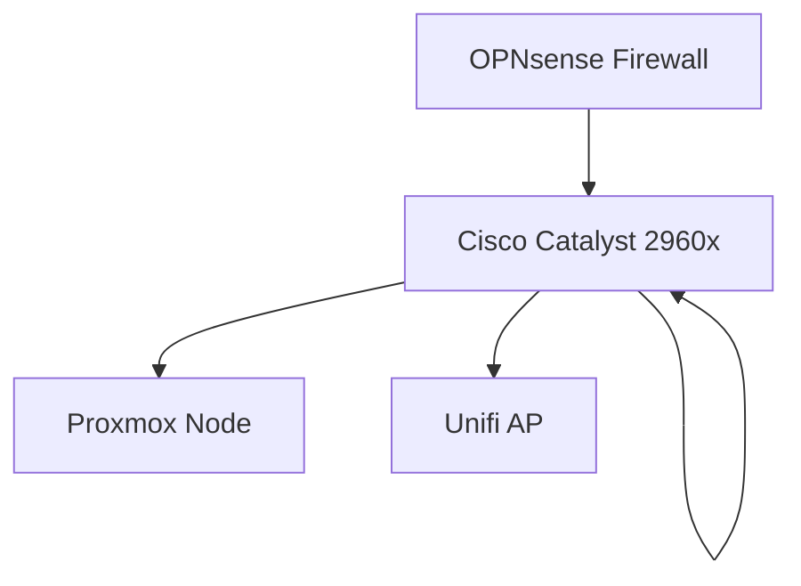

# Welcome to Mosh The Subnet 🎸🤘

I'm **Skyler King**—a Network Support Specialist, homelab enthusiast, and emo/punk rock fan.

I document my journey from "it works on my machine" to enterprise-grade network engineering here. Whether it's breaking OSPF in the lab or fixing critical infrastructure in production, this is where I write it down.

---

## ⚡ Current Status
**Role:** Network Support Specialist 
**Focus:** Cisco Enterprise Networking, Automation, & Network Security
**School:** WGU (B.S. Network Engineering & Security - Cisco Track)

---

## 🏆 Recent Wins (Resume Highlights)
*Real-world problems I've solved recently:*

* **🚑 Critical Infrastructure Rescue:** Saved ~15k in operational delays by diagnosing and fixing a critical IPsec VPN tunnel failure that had downed a production licensing server.
* **🛡️ Network Segmentation:** Improved network performance by **30%** and reduced security risks by migrating a flat Layer 2 network to a secure, 5-VLAN segmented architecture.
* **🚀 Rapid Site Deployment:** Built the IT infrastructure for a newly acquired office (25 workstations + conferencing) from zero to full operation in just **48 hours**.

---

## 📜 Certifications
* Validated skills. No paper tigers here.*

| Badge | Certification | Date |
| :--- | :--- | :--- |
| **CBROPS** | Cisco Certified Cybersecurity Associate | Jun 2025 |
| **CCNA** | Cisco Certified Network Associate | Feb 2025 |
| **ITIL 4** | ITIL Foundation | Jun 2024 |
| **LPI** | Linux Essentials | May 2024 |
| **A+** | CompTIA A+ | Mar 2024 |

---

## 🛠️ The Stack (Lab & Prod)
**Hardware:** Cisco (Routers/Switches), Ubiquiti Unifi, Custom Proxmox Nodes
**Software:** OPNsense, Docker, Splunk, Wireshark
**Automation:** Python, Ansible, Terraform

---

[Check out my full Bio & Projects](./bio.md){ .md-button .md-button--primary }

---

## 📬 Connect With Me

* **Instagram:** [@moshthesubnet](https://instagram.com/moshthesubnet)
* **LinkedIn:** [skylerkingnetwork](https://www.linkedin.com/in/skylerkingnetwork)
* **GitHub:** [moshthesubnet](https://github.com/moshthesubnet)
