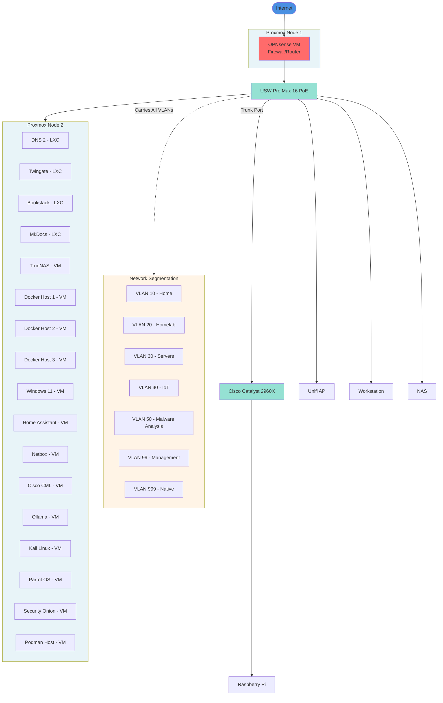

# :material-guitar-electric: :material-home-lightning-bolt-outline: Welcome to Mosh The Subnet 

  

I'm **Skyler King**—a Network Support Specialist, homelab enthusiast, and emo/punk rock fan.

I document my journey from "it works on my machine" to enterprise-grade network engineering here. Whether it's breaking OSPF in the lab or fixing critical infrastructure in production, this is where I write it down.

---

## ⚡ Current Status

**Role:** Pursuing Entry-Level Networking Roles  
**Focus:** Cisco Enterprise Networking, Automation, & Network Security  
**School:** WGU (B.S. Cisco, Cloud & Network Engineering)

---

## 🏆 Recent Wins

*Real-world problems I've solved:*

* **🚑 Critical Infrastructure Rescue:** Saved ~$15k in operational delays by diagnosing and fixing a critical IPsec VPN tunnel failure that had downed a production licensing server.
* **🛡️ Enterprise Network Segmentation:** Improved network performance by **30%** and eliminated VLAN 1 security vulnerabilities by migrating from a flat network to a secure, 7-VLAN architecture with dedicated management VLAN.
* **🚀 Rapid Site Deployment:** Built the IT infrastructure for a newly acquired office (25 workstations + conferencing) from zero to full operation in just **48 hours**.

---

## 📜 Certifications

*Validated skills. No paper tigers here.*

| Badge | Certification | Date |
| :--- | :--- | :--- |
| **CLOUD+** | CompTIA Cloud+ | Dec 2025 |
| **CBROPS** | CCNA Cybersecurity | Jun 2025 |
| **CCNA** | Cisco Certified Network Associate | Feb 2025 |
| **ITIL 4** | ITIL Foundation | Jun 2024 |
| **LPI** | Linux Essentials | May 2024 |
| **A+** | CompTIA A+ | Mar 2024 |

---

## 🛠️ The Stack (Lab & Prod)

* **Hardware:** Cisco (Routers/Switches), Ubiquiti Unifi, Custom Proxmox Nodes
* **Software:** OPNsense, Docker, Splunk, Wireshark
* **Automation:** Python, Ansible, Terraform

 

---

## 🔥 Featured Project

### VLAN Segmentation & Security Hardening

Redesigned my homelab network from an insecure flat configuration to a properly segmented architecture following industry best practices.

**Key Achievements:**

- Eliminated VLAN 1 security vulnerabilities
- Implemented secure native VLAN (999) to prevent VLAN hopping attacks
- Created dedicated management network (VLAN 99) for administrative access
- Deployed 7-VLAN architecture isolating home, malware analysis, homelab, servers, IoT, and management traffic

[View Full Documentation →](projects/VLAN_segmentation.md){ .md-button .md-button--primary }

---

[Read My Full Story](./bio.md){ .md-button .md-button--primary }
[Explore The Lab](./lab/overview.md){ .md-button }
[View All Projects](./projects/projects.md){ .md-button }

---

**Connect:**
[:fontawesome-brands-instagram: Instagram](https://instagram.com/moshthesubnet) · 
[:fontawesome-brands-linkedin: LinkedIn](https://www.linkedin.com/in/skylerkingnetwork) · 
[:fontawesome-brands-github: GitHub](https://github.com/moshthesubnet)
