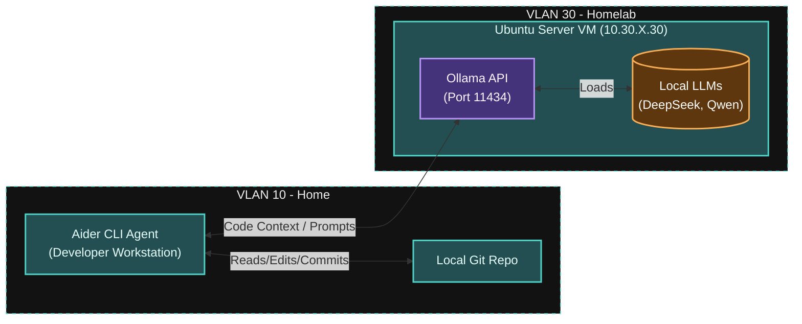

# Local AI Coding Agent Project (Ollama + Aider)

## Project Overview
This project documents the design, deployment, and configuration of a fully localized AI coding assistant using Ollama as the inference engine and Aider as the command-line interface (CLI) agent, hosted on a dedicated Ubuntu Virtual Machine within the homelab environment.

## Executive Summary
Successfully migrated from cloud-dependent AI coding assistants (e.g., GitHub Copilot, OpenAI API) to a private, self-hosted LLM architecture. By provisioning an Ubuntu VM running Ollama and connecting it to Aider, this implementation achieves zero-cost inference, absolute code privacy, and a seamless terminal-based AI pair programming experience. 

---

## System Architecture

### Interactive Topology


## Architecture Evolution

### Before: Cloud-Dependent Workflow

The original development workflow relied on external APIs, presenting several constraints:

| Service | Dependency | Drawbacks |
|---------|-----------|-----------|
| GitHub Copilot | Cloud Subscription | Recurring monthly cost, limited context control |
| OpenAI / Claude | External Network | Pay-per-token costs, potential rate limits |
| Web UI Chatbots | Manual Copy/Paste | Context switching, disjointed workflow, lack of Git integration |

**Key Issues Identified:**

- Proprietary or sensitive code leaving the local network
- Unpredictable billing based on token usage during heavy refactoring
- Lack of offline development capabilities

### After: Improved Local Topology

The redesigned workflow brings all AI inference in-house:

| Component | Network Location | Purpose |
|-----------|-----------------|---------|
| Ubuntu VM | VLAN 30 (HOMELAB) | Dedicated host for the AI inference engine |
| Ollama | VM Localhost (Port 11434) | Model manager and API provider |
| Local LLMs | VM Storage | Specialized coding models |
| Aider | Dev Workstation | Terminal-based AI agent with direct Git and file access |

**Improvements Implemented:**

- **100% data privacy:** No code snippets are transmitted over the internet
- **Zero recurring costs** for AI inference
- **Automated Git operations:** Aider directly edits files and commits to Git
- **Hot-swappable models:** Ability to swap specialized models depending on the coding task

---

## Technical Implementation

### Design Decisions

#### 1. Dedicated Ubuntu VM for Inference

Running LLMs is highly resource-intensive. Isolating this workload on a dedicated Ubuntu VM in Proxmox prevents AI tasks from starving essential services (like TrueNAS or OPNsense) of RAM or CPU cycles.

#### 2. Ollama as the Backend Engine

Ollama abstracts away the complexity of compiling llama.cpp and managing model weights manually. It provides a clean, OpenAI-compatible REST API out of the box, which is a requirement for most downstream AI tools.

#### 3. Aider as the Developer Interface

Aider is purpose-built for AI pair programming in the terminal. It understands Git repositories, maps out repository architectures, and applies diffs directly to source files.

---

## Configuration Examples

### 1. Ollama Installation (Ubuntu VM)

```bash
# Install Ollama via official script
curl -fsSL https://ollama.com/install.sh | sh

# Pull specialized coding models
ollama pull deepseek-coder-v2
ollama pull qwen2.5-coder:7b
```

### 2. Exposing Ollama API to the Homelab

By default, Ollama only listens on localhost. To allow Aider to connect from a workstation, the service must be modified.

```bash
# Edit the systemd service
sudo systemctl edit ollama.service
```

Add the following environment variable to bind to the VM's network IP:

```ini
[Service]
Environment="OLLAMA_HOST=0.0.0.0"
```

Restart the service:

```bash
sudo systemctl daemon-reload
sudo systemctl restart ollama
```

### 3. Aider Execution (Developer Workstation)

```bash
# Set the API base to the Ubuntu VM (assuming IP is 10.30.X.30)
export OLLAMA_API_BASE=http://10.30.X.30:11434

# Launch Aider specifying the local model via LiteLLM routing
aider --model ollama_chat/deepseek-coder-v2
```

---

## Security & Performance Enhancements

### Air-Gapped Data Flow

All code analysis and generation happen strictly within the HOMELAB VLAN. No external DNS resolution or outbound internet traffic is required during the actual coding phase.

### API Access Control

Ollama API (port 11434) is exposed, but restricted via the OPNsense firewall. Only traffic originating from the specific Developer Workstation IP (VLAN 10) is allowed to hit the API port on the Ubuntu VM (VLAN 30).

---

## Testing and Validation

### Connectivity and Generation Testing

| Task | Model | Expected Result | Actual Result |
|------|-------|----------------|---------------|
| Simple Python Script | Qwen2.5-Coder:7b | Generates script, Aider applies diff | ✅ Pass |
| Complex Refactoring | DeepSeek-Coder-v2 | Understands multi-file context | ✅ Pass |
| VM API Reachability | N/A | Workstation can curl http://10.30.X.30:11434 | ✅ Pass |
| Outbound Network Drop | Llama-3-Instruct | Generates code with WAN disconnected | ✅ Pass |

### Verification Commands

```bash
# Verify Ollama service status on the VM
systemctl status ollama

# List installed local models
ollama list

# Test API connectivity from the workstation
curl http://10.30.X.30:11434/api/tags
```

---

## Future Enhancements

- **GPU Passthrough:** Implement PCIe passthrough in Proxmox to assign a dedicated Nvidia GPU to the Ubuntu VM, drastically increasing token-per-second (t/s) generation speed
- **Open WebUI Implementation:** Spin up a Docker container for Open WebUI on the VM to provide a ChatGPT-like interface for general-purpose queries
- **Model Auto-Updating:** Write a cron job or Ansible playbook to periodically run `ollama pull <model>` to ensure local models are updated

---

## Documentation and Maintenance

**VLAN Assignment:** 30 (HOMELAB)  
**IP Address:** 10.30.X.30  
**VM Specs:** 10 vCPU, 32GB RAM, 200GB NVMe Storage, GPU-PCIE passthrough-NVIDIA GTX 1070TI

### Change Management

1. Evaluate new model benchmarks on HuggingFace/LMSYS
2. Test the model via CLI (`ollama run`) to gauge memory footprint
3. Integrate with Aider using a test repository to verify context-handling capabilities
4. Update local documentation with the new preferred model string
